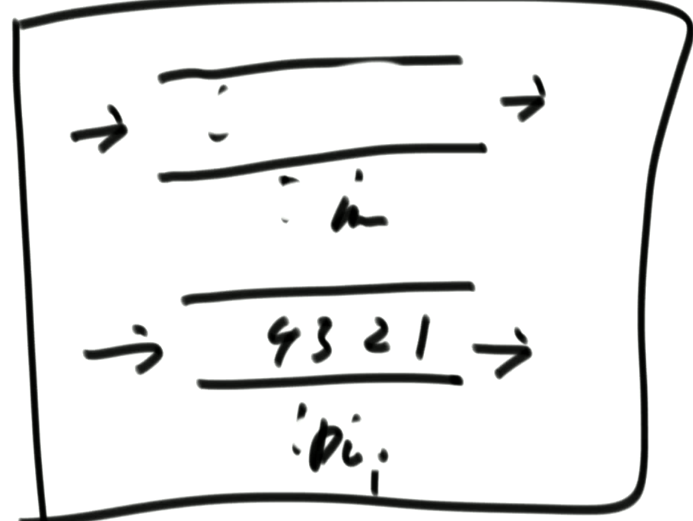

#   算法

-   README中是针对算法一些关键词科普
-   项目中的代码是本人算法中的练习
-   算法学习完全根据左程云算法视频学习，所以会出现一些视频截图
-   需要看视频的小伙伴可以去正规渠道购买课程，本人不会提供任何视频


##   基本概念


### 时间复杂度

O代表最差情况

只取最高阶项

忽略系数


### 额外空间复杂度

与功能无关 为了实现功能必须创建的额外空间


### 常数项时间

高阶一样 可以用常数时间比较

但是一般不要去计算常数项，直接找大数据样本跑结果比较


### 最优解

先保证足够低的时间复杂度，再优化额外空间复杂度


### 常见的时间复杂度

从好到差：

1.   O(1)
2.   O(logN)
3.   O(N)
4.   O(N*logN)
5.   O(N^2)
6.   O(2^N) 递归展开
7.   O(N!) 全排列


### 对数器

1.   想测的方法a
2.   复杂度不好但是容易实现的方法b
3.   实现一个随机样本产生器
4.   方法a和方法b跑相同的测试样本，看结果是否相同
5.   如果结果不相同，调整
6.   如果结果相同，正确


## 排序

### 选择排序 O(N^2)

1.   将1-N中最小的放在第一位
2.   将2-N中最小的放在第二位

。。。


### 冒泡排序 O(N^2)

1.   从1开始两两比较，大的放后面，直到最大数到N
2.   从1开始两两比较，大的放后面，直到最大数到N-1

。。。


### 插入排序 O(N^2)

1.   做到0-1之间有序
2.   做到0-2之间有序
3.   。。。
4.   做到0-N之间有序

如果本身有序这个时间复杂度和上面两个不同

[1,2,3,4,5,6] O(N)

[6,5,4,3,2,1] O(N^2) 按最差情况估计


### 归并排序 O(N*logN)

-   左边让他有序

-   右边让他有序
-   想办法把两边合并 并有序 


-   准备一个同等长度的额外结构
-   两个指针互相比较 哪个小哪个往里面放
-   都结束就全部放进去


之所以比上面三个好 因为他没有浪费比较行为， 比较的行为会一直保留


##### 面试题：一个数组 把左边小数都累加起来

[2,3,4,3] 2 + 2  + 3 + 2

很难

思想：

-   先看右边有几个数比当前数大就产生多少个当前数（与题目是等效的）
-   然后按左右组排序

实现：

-   利用归并
-   分组比较 并排序
-   将左组与右组比较，双指针 比较指针大小


##### 降序对 （上面的思想）


### 快速排序 O(N*logN)

##### 三色国旗问题

) 1, 2, 3, 5, 8, 3 (

-   准备2个指针
-   ==num break
-   小于num 小指针右边一个交换， 小指针++
-   大于num 大指针与i交换 `i不变`
-   当i于大指针碰到 循环结束


##### 快排1.0 O(N^2)

利用荷兰国旗问题 不断递归

每次都将最后一个数去做递归 左边大于等于 右边大于


##### 快排2.0 O(N^2)

利用荷兰国旗问题 不断递归

每次都将最后一个数去做递归 左边大于 右边大于 中间的等于不动


##### 快排3.0 O(N*logN)

随机选一个数 拿它做划分  L R之间的随机一个数

partation方法中返回中间区域两边的index


### 计数排序 O(N)

-   统计一个数组中记录着每个人的年龄 统计每个年龄出现多少人
-   使用另外一个help数组0-200 遍历原始数组 ，统计每个年龄出现多少次
-   遍历help数组 创建一个新的数组
-   桶排序思想的一种


##### 桶排序

-   使用额外容器的排序
-   `有条件` 需要数据样本有范围 或者 特殊的


### 基数排序

条件

-   非负数（改写能改成负数 先将所有数都加上最小负数的绝对值 结束后再减去）
-   能表达成10进制的数


思想

-   准备10个桶 代表每一位 0-9
-   根据个位数字进桶 再倒出来 个位有序
-   根据十位数字进桶 再倒出来 十位有序 （从左到右 很重要）
-   。。。
-   最后就会有序


优化

-   准备一个新数组count[10] 记录个位每种数组出现的次数[1,3,2,0,0,0...0]（长度是10）
-   然后调整成累加和的形式count'[1,4,6,6,6,6...6] (每个数字代表小于等于index的数字总共有几个)
-   准备一个新数组，原数组从右向左遍历 假如个位是2 看小于等于2的数字有几个，假如有6个 这个数字放到这个数组的index6 然后count'的当前位数统计数字-1
-   可以理解成count'维护的是出桶的位置 不是个数


### 排序分类

-   基于比较 （最好的复杂度是O(N*logN)）
    -   冒泡
    -   插入
    -   选择
    -   归并
    -   快排
    -   堆
    -   希尔
-   不基于比较（最好的复杂度是O(N)）无法使用比较器 所以对条件很苛刻
    -   桶排序（计数排序）


### 排序算法的稳定性

-   稳定性指同样大小的样本再排序之后`不会改变相对次序` (不会改变之前数组的顺序)
-   对基础类型来说，稳定性毫无意义
-   对非基础类型来说，稳定性有重要意义
-   有些排序算法可以实现成稳定的，有些算法无论如何都无法实现成稳定的


例子：

-   每个学生都有班级、年龄 两个属性
-   先按年龄排序
-   再按班级排序
-   差异
    -   有稳定性：经过两次排序后 每个班级下面的学生也是按照年龄排序的
    -   无稳定性：经过两次排序后 只有班级有序


### 排序算法总结


-   不基于比较的排序，对样本数据要求严格，不易改写
-   基于比较的排序，时间复杂度极限就是O(N*logN)
-   不存在时间复杂度`O(N*logN)`、额外空间复杂度低于`O(N)`、且`稳定`的排序
-   `快排`比`归并`、`堆排序`速度更快 常数时间更短(通过大量实验得到的`结论`)
-   要求稳定性用`归并排序` 要求额外空间小用`堆排序`


##### 关于排序的坑帖子

-   归并排序额外空间变成O(1)，美其名曰“归并排序 内部缓存法”，但是将不再稳定
-   “原地归并排序”，时间复杂度会变成O(N^2)
-   “O1 stable sort”，快排稳定性改进，但是对样本数据进行要求


##### 坑面试题

-   整形数组中包含奇、偶两种数
-   要求将奇数放在左边，偶数放在右边
-   保证原始相对次序不变
-   时间复杂度`O(N)` 额外空间复杂度`O(1)`


这个要求只能用O1 stable sort 做到 但是很难


### 工程上对排序的改进

##### Arrays.sort() 方法

-   当传入`基本类型`的时候，内部会使用`快排`，因为`不需要稳定性`
-   当传入`非基本类型`的时候，内部使用`归并排序`，保证`稳定性`


##### 快排的改进

一些语言中，在`快排`方法中判断左右指针是否超过60，没超过60使用`插入排序`

-   N很`大`的时候`O(N*logN)`好于`O(N^2)`
-   N很`小`的时候 `常数项`更低更好


## 二分

只要构建出排掉右边一侧的逻辑 就可以使用二分 不一定非要有序

### 有序数组 找某个数的位置

N N/2 N/4 N/8 。。。

N = 2^?

logN


### 取中值

(L+R) / 2 = L + ( ( R - L ) >>  1 ) 

更安全 更不会超int范围


引申

N*2 + 1 = N << 1 | 1

因为左移 补位为0


### 局部最小问题

定义：

1.   0，1位置 0小 为局部最小
2.   N-1，N位置 N小 为局部最小
3.   i-1，i，i+1 i小 为局部最小


一个无序数组，相邻不等， 返回一个局部最小位置的数

思路：

1.   看0，1位置是不是局部最小
2.   看N-1，N位置是不是局部最小
3.   都不是那局部最小一定在中间


## 认识异或运算

### 原则

二进制：不同为1 相同为0

理解为无进位相加


### 性质

1.   0^N == N N^N ==0
2.   异或满足交换律和结合律


### 题目

-   不用额外变量，交换两个数的值

​	a = a ^ b // a = x ^ y, b = y

​	b = a ^ b // a = x ^ y, b = x

​	a = a ^ b // a = y, b = x

​	关键在于a，b不能在同一内存区域


-   一个数组中有一个数出现了奇数次，其他数都出现了偶数次，怎么找到这个数

​	声明一个变量eor = 0，然后异或所有其他数


-   怎么把一个int型数，提取出最右侧的1

​	N & ( (~N) + 1)

​	N = 0010 0100

​	~N = 1101 1011

​	~N + 1 = 1101 1100


其他应用： 数二进制1位数 

获得到最后一位后 异或原来的数


-   一个数组中两种数出现奇数次，其他偶数次，怎么找到这两种数

​		1.异或一遍 得到a ^ b

​		2.分析 a b 不相等 eor一定在某一位上有1 在这位a，b不等 这样数字可以拆为两类 （使用上面）

​		3. a，b一定不在一边


## 单链表/双链表


### 如何反转

参数肯定是一个Node（头部） 返回值也是一个Node（头部）

##### 单链表


循环外声明前一个节点（用于将当前节点的next指向它实现反转）和下一个节点（用于记录）

第一次进入循环需要用next指针记录下一个节点位置（只是记录一下）

然后改变当前节点的next指针 指向前一个节点

head 和 next 各向前移动一个节点


过程中需要3个变量 pre（前一个节点） head（当前节点） next（后一个节点）

双链表一样 只是值不一样


### 删除给定值

Node f（Node node，int value）

首先找到第一个不为value的节点，作为head

遍历剩下的节点 如果为值value那就将上个节点的next 指向当前节点的next（让目标节点没有指向）


## 栈/队列

栈/队列 用双向链表实现

-   一般都要有head、tail节点


固定大小的栈 用数组实现

-   长度不变
-   用index表示位置，插入index++ 弹出index--


固定大小的队列 用数组实现（环形数组）

-   两个指针 一个put 一个pull
-   一个size（当前数量） 一个limit（数组大小）
-   不用关心put pull之间的关系，只关心size 和 limit 直接变得轻量化


### 栈

先进后出（弹夹）


### 队列

先进先出


### 面试题

##### 栈中有push pop getMin 三个方法 且都是O（1）的时间复杂度，如何实现


-   push操作，有增加一个最小栈，当前入栈的数和最小栈栈顶哪个数小 最小栈加谁
-   pop操作，同步弹出 给数据栈的栈顶返回
-   getMin操作，获得最小栈栈顶就行了


##### 如何用栈结构实现队列结构


-   两个栈，一个push 一个pop
-   只有pop为空的时候才能从push导入
-   push必须一次性导出所有数据到pop


###### 如何用队列结构实现栈结构



-   两个队列 一个data 一个help
-   弹出的时候将前面数据导入help 最后一个数弹出
-   第二次弹出的时候data help互换角色


## 递归

### 逻辑

推荐所有``递归``都画出脑图


### 实现

-   其实是使用``系统栈``执行的，递归是使用它遍历
-   任何``递归行为``都可以改为`非递归行为`
-   T(N) = aT(N/b) + O(N^d).   符合这个公式直接确定``时间复杂度``
    -   a 方法中执行几次递归调用 
    -   b 每次方法中的变量都是样本的几分之b
    -   d 除了两次调用之外的时间复杂度


## Hash

hash表`增、删、改、查`都是`O（1）`的时间复杂度

如果单样本大小不可忽略，时间复杂度为`O(K)` K为样本长度


### 有序hash表

TreeMap（按key的大小排序）`增、删、改、查`都是`O（logN）`的时间复杂度


## 比较器

-   继承Comparator<> 接口
-   返回正数的时候，第二个参数在前
-   返回负数的时候，第一个参数在前
-   返回0，认为谁在前面都可以


## 堆结构（包含排序）

堆其实就是`优先级队列`， Java中的 `PriorityQueue`


### 完全二叉树

-   满的二叉树
-   一个节点的树
-   左右向右依次变满的二叉树


##### 节点规律

-   左孩：2*i+1
-   右孩：2*i+2
-   父：（i-1）/2（向下取整）
-   树中的叶子节点都是N/2


### 堆的条件

-   完全二叉树
-   大根堆：每个节点都是子节点/孙子节点。。。的最大值（可以相等）
-   小根堆：每个节点都是子节点/孙子节点。。。的最小值（可以相等）


### 堆的使用

-   堆可以使用数组表示，脑补一颗二叉树
-   heapInsert O(logN)：插入后根据节点规律去找父比较，满足条件就替换 直到顶部 （位置交换）
-   heapify O(logN)：下沉 首节点跟下面两个字节点中更大的或更小的比较，能交换就交换 直到底部


### 排序

-   数组一个大根堆（从下往上建大根堆可以做到O(N*logN) ）
-   最大值0位置 跟N-1位置交换 size变成 N-1
-   再调整回大根堆
-   最大值0位置 跟N-2位置交换 size变成 N-2
-   再调整回大根堆
-   。。。
-   当size变成0的时候就排好序了


##### 从下建大根堆 O(N*logN)

-   一开始最下面的子树就已经是大根堆了
-   然后上一层没每个节点树调整成大根堆
-   。。。
-   直到整颗树都变成大根堆

-   实现时for循环 调用heapify


### 堆结构创建

-   从上往下建：越接近叶子节点 数量越多 每次处理N层
-   从下往上建：越接近叶子节点 数量越多 每次处理1层
-   如果是一次性把数组给你 可以只用heapify方法
-   如果是一个一个给 就需要用到heapInsert方法 （堆结构）


### 面试题

##### 面试题1

-   一个无序数组
-   排序后每个元素都不会移动超过K


-   利用小根堆 将0-k的数弹到第一位
-   将1-k+1位置的数弹到第二位
-   。。。
-   直到结束


##### 面试题2

-   重合线段问题
    -   重合区域的长度> 1
    -   将几个线段中重合线段最多的线段返回


解法1.  O((max - min) * N)

-   取线段中的min 和 max
-   min和max中的 .5 都判断有多少线段
-   将最多的返回


解法2 （如果前面几个都重合 碰到下一个堆中的左边界大于最右边界的情况怎么办 不是就无法返回最大重合了么）

-   先排序 按照左边界从小到大
-   准备一个小根堆
-   每次都讲堆中小于等于左边界的数弹出，右边界放进去


##### 面试题3

-   手动改写堆题目问题

    -   返回每个时间点的获奖名单
    -   给定一个整型数组int[] arr，一个布尔数组boolean[] op
    -   两个数组一定等长
    -   arr[i]，代表i哪位用户购买了1件商品 op[i]，代表了用户是退款还是购买
    -   有一个`获奖区` 有一个`侯奖区`， 购买东西多的用户可以从`侯奖区`进入`获奖区` 顶替`获奖区`最后一名的获奖者
    -   比较顺序是优先购买数量，相同的话比较第一次购买时间 越早的名次越高
    -   退货为0的话直接退出`所有奖区`
    -   数量为0再退货，直接忽略
    -   得奖区获奖区两套时间，进出时间都重新计算

    

    

    题解

    ```java
    public void operate(int time, int id, boolean buyOrRefund) {
    			if (!buyOrRefund && !customers.containsKey(id)) {
    				return;
    			}
    			if (!customers.containsKey(id)) {
    				customers.put(id, new Customer(id, 0, 0));
    			}
    			Customer c = customers.get(id);
    			if (buyOrRefund) {
    				c.buy++;
    			} else {
    				c.buy--;
    			}
    			if (c.buy == 0) {
    				customers.remove(id);
    			}
    			if (!candHeap.contains(c) && !daddyHeap.contains(c)) {
    				if (daddyHeap.size() < daddyLimit) {
    					c.enterTime = time;
    					daddyHeap.push(c);
    				} else {
    					c.enterTime = time;
    					candHeap.push(c);
    				}
    			} else if (candHeap.contains(c)) {
    				if (c.buy == 0) {
    					candHeap.remove(c);
    				} else {
    					candHeap.resign(c);
    				}
    			} else {
    				if (c.buy == 0) {
    					daddyHeap.remove(c);
    				} else {
    					daddyHeap.resign(c);
    				}
    			}
    			daddyMove(time);
    		}
    ```

    

    


### 增强堆

-   系统提供的堆结构只能维护堆结构，或者弹出堆顶的属性（无法`高效`指定修改某个节点）
-   主要因为没有`反向索引表`

```java
public class HeapGreater<T> {

  // 实际的堆
	private ArrayList<T> heap;
  // 反向索引表
	private HashMap<T, Integer> indexMap;
	private int heapSize;
	private Comparator<? super T> comp;

	public HeapGreater(Comparator<T> c) {
		heap = new ArrayList<>();
		indexMap = new HashMap<>();
		heapSize = 0;
		comp = c;
	}
```


## 前缀树

`prefix tree`，`trie树`


-   每个字符串字符创建一条通向下一个字符的`路`
-   每个节点增加两个值 
    -   `pass`有多少字符串通过这个节点
    -   `end`有多少字符串以这个节点为结束
-   可以很快查询`相同前缀`的字符串数量


查询前缀就是`O(K)` K就是查询字符串的长度

```java
public static class Node1 {
		public int pass;
		public int end;
		public Node1[] nexts;

		// char tmp = 'b'  (tmp - 'a')
		public Node1() {
			pass = 0;
			end = 0;
			// 0    a
			// 1    b
			// 2    c
			// ..   ..
			// 25   z
			// nexts[i] == null   i方向的路不存在
			// nexts[i] != null   i方向的路存在
			nexts = new Node1[26];
		}
	}
```


## 链表

**<u>链表最难的就是边界问题！</u>**


中点问题解题思路一般两种

-   遍历链表 放入数组中

-   快慢指针

    -   慢指针每次跳一个节点

    -   快指针每次跳两个节点

        

### 快慢指针小题

-   链表奇数返回中点，偶数返回上中点
-   链表奇数返回中点，偶数返回下中点
-   链表奇数返回中点前一个，偶数返回上中点前一个
-   链表奇数返回中点后一个，偶数返回下中点后一个


### 解题时的方法论

-   笔试
    -   时间复杂度第一，不用考虑空间复杂度，尽快完成进入下一题
-   面试
    -   时间复杂度第一，找到最省空间的办法


### 判断一个链表是不是回文

-   使用栈结构，全部放进去看看弹出来后和之前是不是一样
-   找到栈的中点、或者上中点
    -   将中点指向null，然后中点后的节点反转
    -   从两边两个指针向中间，一直比较
    -   偶数的话，判断有一个null 就返回


##### 回文子问题

L1 -> L2 -> L3 -> L4 -> R1 -> R2 -> R3 -> R4 转为

L1 -> R4 -> L2 -> R3 -> L3 -> R2 -> L4 -> R1


-   这个其实就是利用回文的问题
-   两边使用指针，找到中点，然后重连指针


### 链表的荷兰国旗的问题

##### 题解1

使用容器

-   （可以申请额外变量的情况）申请一个数组，在数组中进行partition


##### 题解2

不使用容器


-   用6个额外节点指针
-   从头开始遍历
-   将6个指针赋值
-   然后串起来（小尾连等头，等尾连大头 ）


### 链表random指针


-   链表中有N指针 指向下一个节点
-   也有一个R指针 随机指向节点
-   如何对这个链表进行复制？


##### 题解1

使用容器

-   先克隆所有节点，然后放入map结构中
-   key为原节点，value为克隆后节点
-   遍历节点 通过Map的get方法设置N指针 和R指针


##### 题解2

不使用容器

-   将`克隆节点`插入`老节点`的next指针上  A -> A' -> B -> B'
-   `克隆节点`的R指针 指向`老节点`的R指针的next上
-   最后将`老节点` 和 `克隆节点`拆出来
